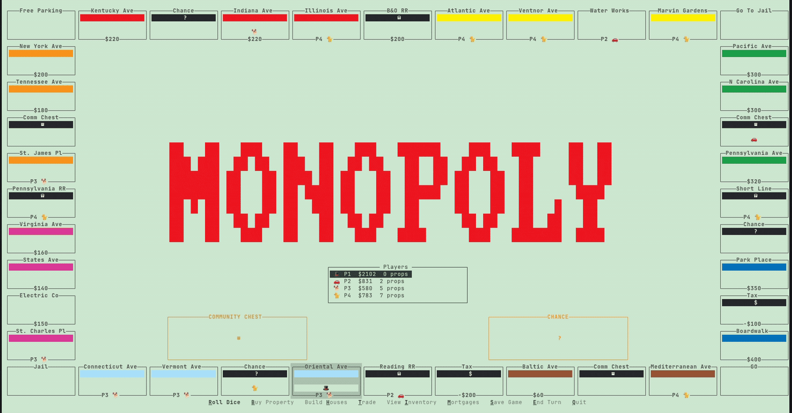
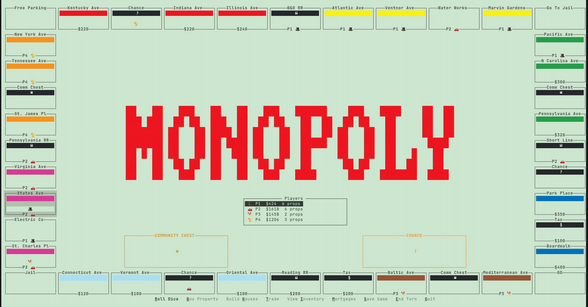
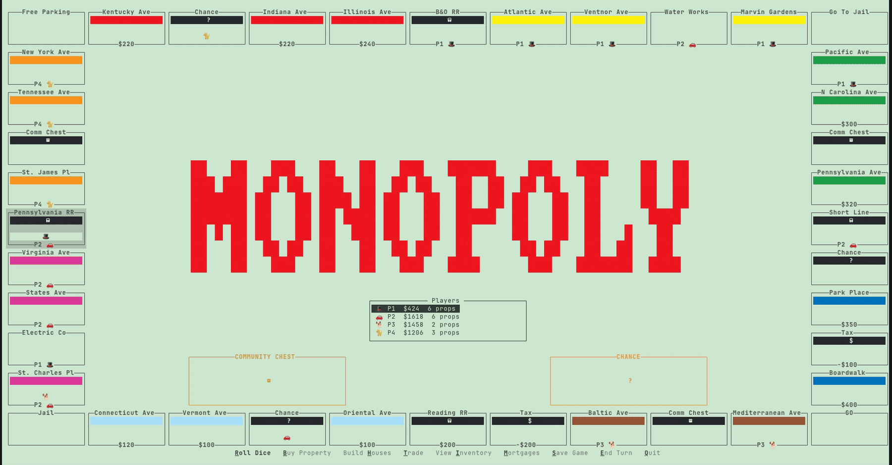

<h1 align="center">Monopoly</h1>

<p align="center">
Monopoly in your terminal.
</p>

<p align="center">
  <a href="https://github.com/MGross21/monopoly/actions/workflows/ci.yml"></a>
  <a href="https://ratatui.rs"></a>
</p>

<p align="center">
  
</p>

## Install

```bash
cargo install --git https://github.com/MGross21/monopoly
```

Or from a clone:

```bash
cargo run --release
```

## Preview

<table>
<tr>
<td width="50%"></td>
<td width="50%"></td>
</tr>
<tr>
<td align="center"><sub>Rolling the dice</sub></td>
<td align="center"><sub>Drawing a Chance card</sub></td>
</tr>
</table>

## Hotkeys

| Key | Action |   | Key | Action |
| --- | --- | --- | --- | --- |
| `r` | Roll dice |   | `i` | View inventory |
| `b` | Buy property |   | `m` | Mortgage / unmortgage |
| `h` | Build houses |   | `s` | Save game |
| `t` | Trade |   | `e` | End turn |

## Rules

Standard US edition, written out in [GAME_RULES.md](./GAME_RULES.md) with sources.
